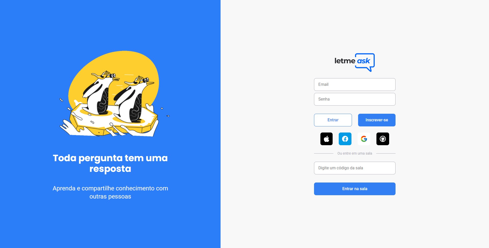

<p align="center">
  
</p>

Projeto desenvolvido no bootcamp [NLW/Together] - [Rocketseat](https://rocketseat.com.br/) com o intuito de facilitar os criadores de conteúdo que precisam organizar as perguntas enviadas por sua audiência mas incrementando novas funcionalidades não tratadas no bootcamping.

---



---

## 🧪 Tecnologias

Foi utilizado o framework [React](https://reactjs.org/) + [Typescript](https://www.typescriptlang.org/) junto com [Sass](https://sass-lang.com/) para estilização dos componentes e o [Firabase](https://firebase.google.com/) como serverless da nossa aplicação.

- [React](https://reactjs.org/)
- [Firebase](https://firebase.google.com/)
- [TypeScript](https://www.typescriptlang.org/)
- [Sass](https://sass-lang.com/)

Quer ver como está ficando? [Acesse a demonstração](https://letmeask-mu-orpin.vercel.app/) que está hospedada na [Vercel](https://vercel.com/)[.](https://letmeask-mu-orpin.vercel.app/)

---

## 🚀 Começando com o projeto

Fique a vontade para clonar este repositório e utilizar ele da forma que bem entender só fique atento as variáveis de ambiente que este projeto utiliza que precisam ser configuradas para seu funcionamento.

```bash
$ git clone https://github.com/thaylorz/letmeask.git
$ cd letmeask

$ yarn
$ yarn start
```

O aplicativo estará disponível para acesso em seu navegador em [http://localhost:3000](http://localhost:3000)

---

## 🆘 Contribuir

Quer contribuir com o projeto, siga o passo a passo

1. Crie um fork!
2. Crie sua feature branch: `git checkout -b my-new-feature`
3. Adicione os arquivos modificados: `git add .`
4. Faça um Commit com suas alterações: `git commit -m "Add some feature"`
5. Faça um push da sua branch: `git push origin my-new-feature`
6. Envie um Pull Request para esse repositório 

> Adicione um título e uma descrição que deixe claro sua sugestão :)

---

## 📝 Licença

Este projeto está licenciado sob a Licença MIT. Consulte o arquivo de [LICENÇA](https://github.com/thaylorz/letmeask/blob/master/LICENSE) para obter detalhes.

---

<p align="center">
  Made with 💙 by Thaylor Santos
</p>
